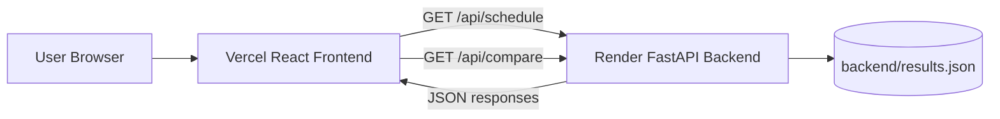

# Microgrid AI: Renewable Battery Scheduling

A full-stack renewable microgrid scheduling system that evaluates battery operating strategies under normal and high-uncertainty conditions. The project compares a rule-based baseline with Genetic Algorithm, Particle Swarm Optimization, and hybrid optimization methods using operating cost, renewable utilization, grid dependency, and hourly battery schedules.

## Live Deployments

- **Frontend:** [Vercel](https://YOUR_VERCEL_PROJECT.vercel.app) - replace the placeholder with the deployed Vercel URL.
- **Backend API:** [Render](https://microgrid-scoa-project.onrender.com)
- **Repository:** [GitHub](https://github.com/Rajankarananya/microgrid-scoa-project)

The backend root endpoint is available at:

```text
https://microgrid-scoa-project.onrender.com/
```

## Project Purpose

Renewable microgrids must decide when a battery should charge, discharge, remain idle, or rely on grid power while renewable generation and demand vary over time. This project provides a reproducible way to compare scheduling methods against three practical objectives:

- Reduce operating cost.
- Increase renewable-energy utilization.
- Reduce dependency on the electrical grid.

The current backend serves precomputed schedules from `backend/results.json`. It does not run the optimization algorithms during an API request. The interface makes the results inspectable through an hourly schedule chart and a method-comparison chart.

## System Architecture



### Main Components

- **Frontend:** React and Vite application in `frontend/`.
- **Backend:** FastAPI application in `backend/main.py`.
- **Data source:** JSON records containing scenarios, methods, hourly actions, battery power, and aggregate metrics.
- **Hosting:** Vercel for the frontend and Render for the backend.
- **Configuration:** Vite environment variables select the backend URL for local and production builds.

## Repository Structure

```text
.
├── backend/
│   ├── main.py
│   ├── requirements.txt
│   ├── results.json
│   └── fake_results.json
├── dataset/
├── docs/
├── frontend/
│   ├── src/
│   │   ├── App.jsx
│   │   ├── ComparisonChart.jsx
│   │   ├── HeroSection.jsx
│   │   ├── HowItWorks.jsx
│   │   ├── main.jsx
│   │   └── index.css
│   ├── .env
│   ├── .env.production
│   ├── package.json
│   └── vite.config.js
└── README.md
```

## Backend API

The FastAPI service loads `results.json` into memory when the application starts.

### Health Check

```http
GET /
```

Response:

```json
{
  "message": "Backend is running"
}
```

### Retrieve a Schedule

```http
GET /api/schedule?week=week_normal&method=hybrid
```

Query parameters:

- `week`: `week_normal` or `week_high_uncertainty`; defaults to `week_normal`.
- `method`: `baseline`, `ga_only`, `pso_only`, or `hybrid`; defaults to `hybrid`.

The response contains parallel `hours`, `action`, and `kw` arrays, plus aggregate metrics:

```json
{
  "hours": [0, 1, 2],
  "action": ["charge", "idle", "discharge"],
  "kw": [1.4151, 0.6902, 0.0],
  "cost": 0.8602,
  "utilization_pct": 47.56,
  "grid_dependency_pct": 3.89
}
```

### Compare All Methods

```http
GET /api/compare?week=week_normal
```

The response maps each method name to its complete schedule record:

```json
{
  "baseline": { "hours": [], "action": [], "kw": [], "cost": 0, "utilization_pct": 0, "grid_dependency_pct": 0 },
  "ga_only": {},
  "pso_only": {},
  "hybrid": {}
}
```

## Frontend Behavior

`App.jsx` controls the selected scenario and method. It requests one schedule and renders:

- Cost, renewable utilization, and grid dependency indicators.
- A Chart.js line chart of battery power across the returned hours.
- Scenario and method selectors.

`ComparisonChart.jsx` requests all methods for the selected scenario and renders a grouped bar chart comparing cost, renewable utilization, and grid dependency.

`HeroSection.jsx` provides the project introduction and navigation, while `HowItWorks.jsx` explains the four scheduling techniques with an interactive accordion. These sections do not fetch backend data.

## Data and Results

The active dataset contains:

- `week_normal`: 72 hourly records per method.
- `week_high_uncertainty`: 168 hourly records per method.
- Four methods per scenario: baseline, GA only, PSO only, and hybrid.

The normal-week optimized methods currently have identical aggregate metrics:

| Method | Cost | Renewable Utilization | Grid Dependency |
|---|---:|---:|---:|
| Baseline | 0.9261 | 47.52% | 3.98% |
| GA only | 0.8602 | 47.56% | 3.89% |
| PSO only | 0.8602 | 47.56% | 3.89% |
| Hybrid | 0.8602 | 47.56% | 3.89% |

Under high uncertainty:

| Method | Cost | Renewable Utilization | Grid Dependency |
|---|---:|---:|---:|
| Baseline | 5.7442 | 37.51% | 16.80% |
| GA only | 5.5896 | 37.55% | 16.72% |
| PSO only | 5.6884 | 37.37% | 16.73% |
| Hybrid | 5.5896 | 37.55% | 16.72% |

`fake_results.json` contains an older 24-hour sample dataset and is not used by the active API.

## Local Development

### Backend

```bash
cd backend
python3 -m venv venv
source venv/bin/activate
pip install -r requirements.txt
uvicorn main:app --reload --host 127.0.0.1 --port 8000
```

The backend will be available at `http://127.0.0.1:8000`.

### Frontend

In a second terminal:

```bash
cd frontend
npm install
npm run dev
```

The local frontend reads [frontend/.env](frontend/.env), which points to `http://127.0.0.1:8000`.

Available frontend commands:

```bash
npm run dev       # Start the Vite development server
npm run lint      # Run ESLint
npm run build     # Create a production build
npm run preview   # Preview the production build locally
```

## Deployment

### Render Backend

Create a Render Web Service with:

- **Root directory:** `backend`
- **Runtime:** Python
- **Build command:** `pip install -r requirements.txt`
- **Start command:** `uvicorn main:app --host 0.0.0.0 --port $PORT`

Render supplies the dynamic `PORT` value. The application does not hardcode a production port or call `uvicorn.run()` itself.

The backend currently permits all CORS origins for initial deployment. After the Vercel domain is known, restrict `allow_origins` in `backend/main.py` to that domain.

### Vercel Frontend

Create a Vercel project configured as follows:

- **Root directory:** `frontend`
- **Framework preset:** Vite
- **Build command:** `npm run build`
- **Output directory:** `dist`
- **Production environment variable:**

```env
VITE_API_URL=https://microgrid-scoa-project.onrender.com
```

The frontend uses this variable in both API requests:

```jsx
`${import.meta.env.VITE_API_URL}/api/schedule?...`
`${import.meta.env.VITE_API_URL}/api/compare?...`
```

The local value remains in `frontend/.env` for development, while the production value is stored in `frontend/.env.production` and should also be set in the Vercel project settings.

## Technology Stack

### Backend

- Python
- FastAPI
- Uvicorn
- JSON file-based data storage
- Starlette CORS middleware through FastAPI

### Frontend

- React
- Vite
- Axios
- Chart.js
- React Chart.js 2
- Framer Motion
- Tailwind CSS

## Validation

The frontend can be checked with:

```bash
cd frontend
npm run lint
npm run build
```

The backend can be syntax-checked with:

```bash
cd backend
python -m py_compile main.py
```

## Current Limitations

- Optimization is represented by precomputed JSON results rather than being executed dynamically.
- There is no database or persistent user configuration.
- API errors for invalid scenario or method names are not converted into custom responses.
- CORS currently allows all origins.
- Some introductory frontend metrics are static values from the older sample dataset and may not match `results.json`.
- The Vercel URL in this README must be replaced after the frontend deployment URL is known.
